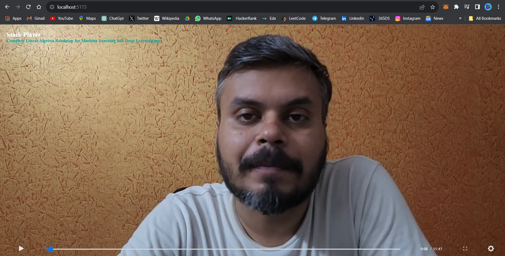

Hello everyone,
<!-- use image -->

I'd like to introduce you to my web application: [Stack Player](https://stackplayer.vercel.app/),
 Currently, the application offers basic features to play videos, but I have a vision to enhance it further.

Stack Player is a versatile video player designed to seamlessly play both offline and online videos. It boasts efficient playback capabilities, ensuring smooth video streaming without buffering interruptions.

Additionally, Stack Player is a web application that will be equipped with advanced features. It can generate automated captions, enabling seamless dubbing of videos from English to Hindi. Moreover, the application will offer various tools, including video quality changers, allowing users to enhance their viewing experience. Additionally, users can obtain a summary of the entire video with just a few clicks.

I invite you to contribute to this open-source project during #hacktoberfest. Your contributions can help us improve and expand Stack Player, making it even better for users worldwide.

Best regards,

Arvind Yadav
GitHub: [https://www.github.com/ayarvind](https://www.github.com/ayarvind)
LinkedIn: [https://www.linkedin.com/in/ayarwind](https://www.linkedin.com/in/ayarwind)

 

#follow this steps to open view code on your system
1. Fork this repository
2. Clone the repository  using `git clone https://github.com/ayarvind/Stack-Player.git`
3. Open the folder in your favourite code editor
4. Run `npm install` to install all the dependencies
5. Run `npm run dev` to start the development server
6. Make changes and create a pull request

